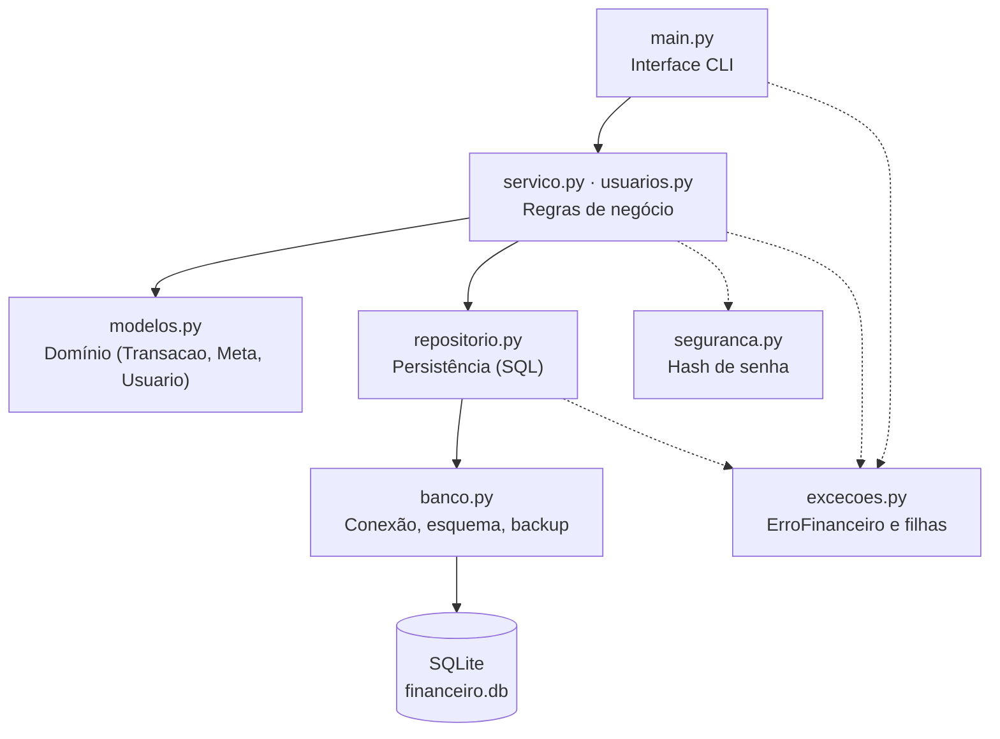
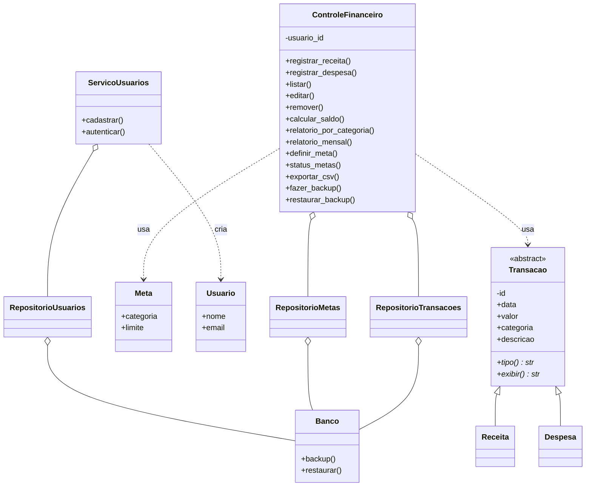
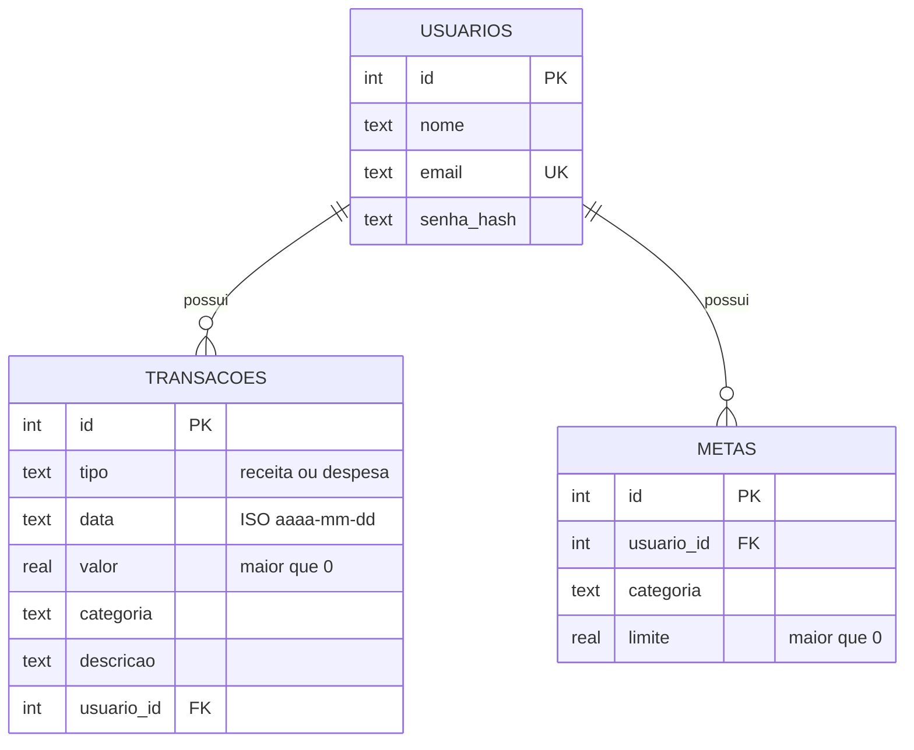
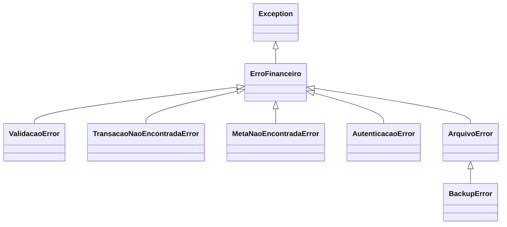

# Arquitetura

Os diagramas usam Mermaid (renderizam automaticamente no GitHub e em VS Code com a extensão Mermaid).

## Camadas

```mermaid
flowchart TD
    UI["main.py<br/>Interface CLI"] --> SRV["servico.py · usuarios.py<br/>Regras de negócio"]
    SRV --> DOM["modelos.py<br/>Domínio (Transacao, Meta, Usuario)"]
    SRV --> REPO["repositorio.py<br/>Persistência (SQL)"]
    REPO --> BANCO["banco.py<br/>Conexão, esquema, backup"]
    BANCO --> DB[("SQLite<br/>financeiro.db")]
    SRV -.-> SEG["seguranca.py<br/>Hash de senha"]
    UI -.-> EXC["excecoes.py<br/>ErroFinanceiro e filhas"]
    SRV -.-> EXC
    REPO -.-> EXC
```

## Diagrama de classes

```mermaid
classDiagram
    class Transacao {
        <<abstract>>
        -id
        +data
        +valor
        +categoria
        +descricao
        +tipo()* str
        +exibir()* str
    }
    class Receita
    class Despesa
    class Meta {
        +categoria
        +limite
    }
    class Usuario {
        +nome
        +email
    }
    Transacao <|-- Receita
    Transacao <|-- Despesa

    class ControleFinanceiro {
        -usuario_id
        +registrar_receita()
        +registrar_despesa()
        +listar()
        +editar()
        +remover()
        +calcular_saldo()
        +relatorio_por_categoria()
        +relatorio_mensal()
        +definir_meta()
        +status_metas()
        +exportar_csv()
        +fazer_backup()
        +restaurar_backup()
    }
    class ServicoUsuarios {
        +cadastrar()
        +autenticar()
    }
    class RepositorioTransacoes
    class RepositorioMetas
    class RepositorioUsuarios
    class Banco {
        +backup()
        +restaurar()
    }

    ControleFinanceiro o-- RepositorioTransacoes
    ControleFinanceiro o-- RepositorioMetas
    ControleFinanceiro ..> Transacao : usa
    ControleFinanceiro ..> Meta : usa
    ServicoUsuarios o-- RepositorioUsuarios
    ServicoUsuarios ..> Usuario : cria
    RepositorioTransacoes o-- Banco
    RepositorioMetas o-- Banco
    RepositorioUsuarios o-- Banco
```

## Modelo de dados

```mermaid
erDiagram
    USUARIOS ||--o{ TRANSACOES : possui
    USUARIOS ||--o{ METAS : possui
    USUARIOS {
        int id PK
        text nome
        text email UK
        text senha_hash
    }
    TRANSACOES {
        int id PK
        text tipo "receita ou despesa"
        text data "ISO aaaa-mm-dd"
        real valor "maior que 0"
        text categoria
        text descricao
        int usuario_id FK
    }
    METAS {
        int id PK
        int usuario_id FK
        text categoria
        real limite "maior que 0"
    }
```

## Exceções

```mermaid
classDiagram
    Exception <|-- ErroFinanceiro
    ErroFinanceiro <|-- ValidacaoError
    ErroFinanceiro <|-- TransacaoNaoEncontradaError
    ErroFinanceiro <|-- MetaNaoEncontradaError
    ErroFinanceiro <|-- AutenticacaoError
    ErroFinanceiro <|-- ArquivoError
    ArquivoError <|-- BackupError
```
